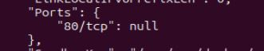
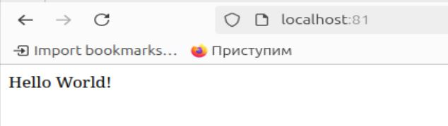

## Part 1. Готовый докер

В качестве конечной цели своей небольшой практики ты сразу выбрал написание докер-образа для собственного веб-сервера, а потому в начале тебе нужно разобраться с уже готовым докер-образом для сервера.
Твой выбор пал на довольно простой **nginx**.

**== Задание ==**

##### Возьми официальный докер-образ с **nginx** и выкачай его при помощи `docker pull`.

*Вывод команды `docker pull nginx`*

##### Проверь наличие докер-образа через `docker images`.

*Вывод команды `docker images`*

##### Запусти докер-образ через `docker run -d [image_id|repository]`.

*Вывод команды `docker run -d nginx`*

##### Проверь, что образ запустился через `docker ps`.

*Вывод команды `docker ps`*

##### Посмотри информацию о контейнере через `docker inspect [container_id|container_name]`.

*Вывод команды `docker inspect cbb6d031f705`*

##### По выводу команды определи и помести в отчёт размер контейнера, список замапленных портов и ip контейнера.

- Размер контейнера: 
- `SizeRw` - размер файловой системы контейнера, которая записывается во время выполнения - 1095 байт
- `SizeRootFs` - общий размер файловой системы контейнера - 187600371 байт

*Вывод команды `docker inspect -s cbb6d031f705`*

- Список замапленных портов (или портов, привязанных/перенаправленных) — это таблица соответствий между портами на хост-машине и портами внутри контейнера в Docker. Это позволяет контейнерам общаться с внешним миром или другими контейнерами на других машинах - "80/tcp": null

*Список замапленных портов*

- IP контейнера - 172.17.0.2

*IP контейнера*

##### Останови докер образ через `docker stop [container_id|container_name]`.

*Вывод команды `docker stop cbb6d031f705`*

##### Проверь, что образ остановился через `docker ps`.

*Вывод команды `docker ps`*

##### Запусти докер с портами 80 и 443 в контейнере, замапленными на такие же порты на локальной машине, через команду *run*.

- `-d` запускает контейнер в фоне
- `-p 80:80` замапливает порт 80 хост-машины на порт 80 контейнера
- `-p 443:443` замапливает порт 443 хост-машины на порт 443 контейнера

*Вывод команды `docker run -d -p 80:80 -p 443:443 nginx`*

##### Проверь, что в браузере по адресу *localhost:80* доступна стартовая страница **nginx**.

*Переходим по адресу `localhost:80` и видим что там стартовая страница nginx*

*Cтартовая страница nginx*

##### Перезапусти докер контейнер через `docker restart [container_id|container_name]`.

*Вывод команды `docker restart af76ce39d79b`*

##### Проверь любым способом, что контейнер запустился.

*Вывод команды `docker ps`*

## Part 2. Операции с контейнером

Докер-образ и контейнер готовы. Теперь можно покопаться в конфигурации **nginx** и отобразить статус страницы.

**== Задание ==**

##### Прочитай конфигурационный файл *nginx.conf* внутри докер контейнера через команду *exec*.

- Команда `docker exec` используется для выполнения команд или процессов внутри запущенного контейнера Docker. В отличие от `docker run`, который создает и запускает новый контейнер, `docker exec` позволяет вам войти в уже работающий контейнер и выполнить команды или запустить дополнительные процессы

*Вывод команды `docker exec af76ce39d79b cat /etc/nginx/nginx.conf`*

- 1. `user nginx;` - указывает пользователя, под которым будет запущен процесс NGINX

- 2. `worker_processes auto;` - автоматически определяет количество процессов-воркеров (worker processes) NGINX. Зависит от количества ядер. Auto запускает по процессу на ядро. Сколько ядер можно узнать командой `nproc`
- Воркер-процессы:
- Обрабатывают все клиентские запросы
- Выполняют все задачи по обслуживанию соединений (чтение запроса, выполнение авторизации, генерация ответов и многое другое)
- Воркеры используют неблокирующий ввод-вывод, что позволяет обслуживать множество соединений без необходимости ожидания завершения операции ввода-вывода

*Вывод команды `nproc`*

- 3. `error_log /var/log/nginx/error.log notice;` - путь к файлу журнала ошибок

- 4. `pid /var/run/nginx.pid;` - файл, в котором хранится PID процесса NGINX

- 5. `events {` - открывает блок для настроек событий.

- `worker_connections 1024;` - максимальное количество соединений на один воркер-процесс. Можно узнать командой `ulimit -n`

*Вывод команды `ulimit -n`*

- 6. `http {` -  открывает блок для HTTP-сервера

- `include /etc/nginx/mime.types;` - включает файл с типами MIME
- MIME (Multipurpose Internet Mail Extensions) — это стандарт, определяющий формат различных типов данных, передаваемых по сети.
- Типы MIME позволяют клиенту (например, браузеру) понять, как обрабатывать и отображать полученные данные. Например, браузер может использовать разные подходы для отображения текстового документа, изображения или видеофайла.
- Тип MIME состоит из двух частей: основные (general type) и подтипа (subtype), разделенных слэшем (`/`).
- Основной тип указывает общую категорию данных (например, текст, изображение, видео).
- Подтип уточняет конкретный формат данных (например, HTML, PNG, MP4).

- `default_type application/octet-stream;` - тип контента по умолчанию
- Директива `default_type` в конфигурационном файле NGINX устанавливает тип MIME по умолчанию для файлов, которые не имеют определенного типа MIME. Она используется для указания того, как сервер должен обрабатывать файлы с неизвестными или неопределенными расширениями
- Когда директива `default_type` установлена в значение `application/octet-stream`, это указывает на бинарный поток данных. Это значение по умолчанию используется для файлов, для которых сервер не может определить тип содержимого. Клиенты, такие как браузеры, обычно обрабатывают `application/octet-stream` как файл для загрузки

- `log_format main '$remote_addr - $remote_user [$time_local] "$request" '$status $body_bytes_sent "$http_referer" "$http_user_agent" "$http_x_forwarded_for"';` - формат логов доступа
- Директива `log_format` в конфигурационном файле NGINX позволяет вам определить собственный формат логов для доступа к вашим веб-ресурсам. Синтакасис: log_format <name> `<формат_лога>`
- `<name>` — это имя нового формата лога. Например, `main`
- `<формат_лога>` — это строка, которая определяет, какие переменные и в каком порядке будут записываться в лог
- `$remote_addr` — адрес удаленного клиента
- `-` — знак дефиса в данном случае помещается, когда переменная отсутствует (например, если отсутствует `remote_user`).
- `$remote_user` — имя удаленного пользователя, если он прошел аутентификацию
- `$time_local` — время запроса
- `$request` — строка запроса (например, `GET /index.html HTTP/1.1`)
- `$status` — код статуса HTTP (например, `200`, `404`)
- `$body_bytes_sent` — количество отправленных байтов в теле ответа
- `$http_referer` — заголовок HTTP Referer
- `$http_user_agent` — заголовок User-Agent, который определяет браузер или другое клиентское приложение
- `$http_x_forwarded_for` — заголовок X-Forwarded-For, который может содержать IP клиентов за прокси

- `access_log /var/log/nginx/access.log main;` - куда записываются логи доступа

- `sendfile on;` - включает использование sendfile
- `sendfile` — это системный вызов (syscall) в Unix-подобных операционных системах, который позволяет эффективно передавать данные из одного файлового дескриптора в другой, минуя пространство пользователя. Этот вызов часто используется для передачи данных файлов с жесткого диска напрямую в сетевое соединение, что позволяет значительно улучшить производительность сервера.

- `keepalive_timeout 65;` - директива `keepalive_timeout` в конфигурационном файле NGINX определяет время ожидания для поддерживаемого клиентского соединения (keep-alive), прежде чем оно будет закрыто сервером. Эта настройка позволяет серверу оставлять соединение открытым для повторного использования, что может значительно уменьшить количество новых TCP-соединений и, следовательно, улучшить производительность и снизить задержки. В нашем случае соединение будет жить 65 секунд.
- Протокол HTTP/1.1 поддерживает механизм keep-alive, который позволяет использовать одно TCP-соединение для передачи нескольких HTTP-запросов и ответов. Это экономит время и ресурсы, так как нет необходимости устанавливать новое соединение для каждого запроса

- `include /etc/nginx/conf.d/*.conf;` - включает дополнительные файлы конфигурации из директории `/etc/nginx/conf.d/`

- Для организации конфигурации и упрощения управления настройками NGINX, часто используется механизм включения дополнительных файлов конфигурации из директории, такой как `/etc/nginx/conf.d/`. Это позволяет разбивать конфигурацию на несколько файлов, что делает ее более структурированной и легкой для управления. Обычно такая практика используется для добавления конфигураций виртуальных хостов (серверов), отдельных настроек или специальных модулей

##### Создай на локальной машине файл *nginx.conf*.

*Создадим файл командой`touch nginx.conf`*

##### Настрой в нем по пути */status* отдачу страницы статуса сервера **nginx**.

*Настраиваем по пути `/status` отдачу страницы статуса сервера  в файле `nginx.conf`*

##### Скопируй созданный файл *nginx.conf* внутрь докер-образа через команду `docker cp`.

*Вывод команды `docker cp nginx.conf af76ce39d79b:/etc/nginx/nginx.conf`*

##### Перезапусти **nginx** внутри докер-образа через команду *exec*.

*Вывод команды `docker exec af76ce39d79b nginx -s reload`*

##### Проверь, что по адресу *localhost:80/status* отдается страничка со статусом сервера **nginx**.

*Проверяем, что по адресу `localhost:80/status` находится страничка со статусом сервера*

##### Экспортируй контейнер в файл *container.tar* через команду *export*.

*Для экспорта контейнера используем команду `docker export -o container.tar af76ce39d79`*

##### Останови контейнер.

*Вывод команды `docker stop af76ce39d79b`*

##### Удали образ через `docker rmi [image_id|repository]`, не удаляя перед этим контейнеры.

*Вывод команды `docker rmi -f nginx`*

##### Удали остановленный контейнер.

*Вывод команды `docker rm af76ce39d79b`*

##### Импортируй контейнер обратно через команду *import*.

*Вывод команды `docker import --change 'CMD ["nginx", "-g", "daemon off;"]' container.tar nginx`*

- `CMD` — эта директива определяет, какая команда должна выполняться при запуске контейнера

- `nginx` — это основной исполняемый файл Nginx

- `-g` — это флаг командной строки, который позволяет передавать отдельные команды непосредственно в конфигурацию Nginx

- `daemon off;` — Эта команда указывает параметр конфигурации Nginx. Обычно Nginx работает как демон (фоновая служба), но в данном случае мы настраиваем его так, чтобы он не работал как демон, а оставался на переднем плане (foreground). Это важно для Docker-контейнеров, потому что Docker спроектирован таким образом, что контейнер завершает свой жизненный цикл, когда основной процесс в контейнере заканчивается. Если Nginx работает как демон (в фоновом режиме), контейнер завершится сразу после его запуска. Поэтому необходимо, чтобы он оставался на переднем плане, чтобы поддерживать контейнер активным

##### Запусти импортированный контейнер.

*Запускаем контейнер командой `docker run -d -p 80:80 -p 443:443 nginx` и проверяем что он запустился командой `docker ps`*

##### Проверь, что по адресу *localhost:80/status* отдается страничка со статусом сервера **nginx**.

*Проверяем, что по адресу `localhost:80/status` находится страничка со статусом сервера*

*Содержимое страницы*

## Part 3. Мини веб-сервер

Теперь стоит немного оторваться от докера, чтобы подготовиться к последнему этапу. Время написать свой сервер.

**== Задание ==**

##### Напиши мини-сервер на **C** и **FastCgi**, который будет возвращать простейшую страничку с надписью `Hello World!`.

*Содержимое файла `mini_server.c`*

- Функция `FCGI_Init()` инициализирует среду выполнения FastCGI для текущего процесса

- Функция `FCGI_Accept()` является ключевой функцией в библиотеке FastCGI. Она служит для ожидания и принятия нового FastCGI-запроса. Когда сервер отправляет запрос, `FCGI_Accept()` возвращает управление программе и позволяет ей обработать этот запрос
- Функция `FCGI_Accept()` возвращает целое число, которое обозначает статус нового запроса:
- Положительное или нулевое число (обычно 0): успешное принятие нового запроса. В этом случае программа должна обработать запрос
- Отрицательное значение: ошибка или завершение обработки запросов. Это служит сигналом выйти из цикла обработки запросов

- `Content-type: text/html` - это HTTP-заголовок, который сообщает клиенту (веб-браузеру), что тип содержимого ответа — это HTML. В данном случае заголовок `Content-type: text/html` говорит о том, что тело ответа будет содержать HTML-документ
- `\r\n` - это специальные символы, обозначающие конец строки в HTTP-заголовках. Символ `\r` (carriage return) переводит курсор в начало строки, а символ `\n` (newline) переводит курсор на новую строку
- `\r\n\r\n` - двойная последовательность `\r\n` используется для отделения заголовков HTTP от самого содержимого (тела) ответа. Первая пара `\r\n` завершает последний заголовок, а вторая пара `\r\n` обозначает окончание раздела заголовков. После этой последовательности начинается тело HTTP-ответа

##### Запусти написанный мини-сервер через *spawn-fcgi* на порту 8080.

- Обновляем пакеты `sudo apt-get update`
- `sudo apt-get install libfcgi-dev` - установка библиотеки FastCGI
- `sudo apt-get install nginx` - установка Nginx
- `sudo apt-get install spawn-fcgi` - установка spawn-fcgi
- Компилируем программу командой `gcc -o mini_server mini_server.c -lfcgi`
- Запускаем сервер командой `spawn-fcgi -p 8080 ./mini_server`

*Вывод команды `spawn-fcgi -p 8080 ./mini_server`*

##### Напиши свой *nginx.conf*, который будет проксировать все запросы с 81 порта на *127.0.0.1:8080*.

- Переименовываем оригинальный конфигурационный файл командой `sudo mv nginx.conf nginx.conf1`

- Создем новый конфигурационный файл `nginx.conf`

*Содержимое файла `nginx.conf`*

- Директива `include fastcgi_params;` - эта директива указывает Nginx включить файл конфигурации `fastcgi_params`, который содержит предопределенные параметры для взаимодействия с FastCGI-приложениями

- Директива `fastcgi_pass 127.0.0.1:8080;` - эта директива указывает Nginx, куда перенаправлять (проксировать) запросы, предназначенные для FastCGI-приложения. В данном случае, все запросы будут проксироваться на FastCGI-приложение, запущенное на локальном хосте (`127.0.0.1`) на порту `8080`

- Перемещаем файл nginx.conf командой `sudo mv nginx.conf /etc/nginx/`

- Перезапускаем nginx командой `systemctl restart nginx`

##### Проверь, что в браузере по *localhost:81* отдается написанная тобой страничка.

*Проверяем, что в браузере по адресу `localhost:81` отображается `Hello World!`*

##### Положи файл *nginx.conf* по пути *./nginx/nginx.conf* (это понадобится позже).

*`nginx.conf` находится по пути `./nginx/nginx.conf`*

## Part 4. Свой докер

Теперь всё готово. Можно приступать к написанию докер-образа для созданного сервера.

**== Задание ==**

*При написании докер-образа избегай множественных вызовов команд RUN*

#### Напиши свой докер-образ, который:
##### 1) собирает исходники мини сервера на FastCgi из [Части 3](#part-3-мини-веб-сервер);
##### 2) запускает его на 8080 порту;
##### 3) копирует внутрь образа написанный *./nginx/nginx.conf*;
##### 4) запускает **nginx**.
_**nginx** можно установить внутрь докера самостоятельно, а можно воспользоваться готовым образом с **nginx**'ом, как базовым._

*Содержимое `Dockerfile`*

*Содержимое `start.sh`*

##### Собери написанный докер-образ через `docker build` при этом указав имя и тег.

*Вывод команды `docker build -t my_server:latest .`*

##### Проверь через `docker images`, что все собралось корректно.

*Вывод команды `docker images`*

##### Запусти собранный докер-образ с маппингом 81 порта на 80 на локальной машине и маппингом папки *./nginx* внутрь контейнера по адресу, где лежат конфигурационные файлы **nginx**'а (см. [Часть 2](#part-2-операции-с-контейнером)).

*Вывод команды `docker run -d -p 80:81 -v $(pwd)/nginx/:/etc/nginx/ my_server:latest`*

*Вывод команды `docker ps`*

##### Проверь, что по localhost:80 доступна страничка написанного мини сервера.

*По адресу `localhost:80` находится мини-сервер*

##### Допиши в *./nginx/nginx.conf* проксирование странички */status*, по которой надо отдавать статус сервера **nginx**.

*Содержимое файла `nginx.conf`*

##### Перезапусти докер-образ.
*Если всё сделано верно, то, после сохранения файла и перезапуска контейнера, конфигурационный файл внутри докер-образа должен обновиться самостоятельно без лишних действий*

*Вывод команды `docker restart 70ca7da54b60`*

##### Проверь, что теперь по *localhost:80/status* отдается страничка со статусом **nginx**

*По адресу `localhost:80/status` находится статус*

## Part 5. **Dockle**

После написания образа никогда не будет лишним проверить его на безопасность.

**== Задание ==**

##### Просканируй образ из предыдущего задания через `dockle [image_id|repository]`.

*Сканируем образ и видим претензии от `dockle`*

##### Исправь образ так, чтобы при проверке через **dockle** не было ошибок и предупреждений.

*Исправляем `Dockerfile` и выдаем необходимые разрешения новому пользователю*

*Повторно сканируем образ, ошибок и предупреждений не возникает*

- Запускаем докер-образ `docker run -d -p 80:81 -v $(pwd)/nginx/:/etc/nginx/ my_server:new`

*По адресу `localhost:80` находится мини-сервер*

*По адресу `localhost:80/status` находится статус*

## Part 6. Базовый **Docker Compose**

Вот ты и закончил свою разминку. А хотя погоди...
Почему бы не поэкспериментировать с развёртыванием проекта, состоящего сразу из нескольких докер-образов?

**== Задание ==**

##### Напиши файл *docker-compose.yml*, с помощью которого:
##### 1) Подними докер-контейнер из [Части 5](#part-5-инструмент-dockle) _(он должен работать в локальной сети, т.е. не нужно использовать инструкцию **EXPOSE** и мапить порты на локальную машину)_.
##### 2) Подними докер-контейнер с **nginx**, который будет проксировать все запросы с 8080 порта на 81 порт первого контейнера.
##### Замапь 8080 порт второго контейнера на 80 порт локальной машины.

*Поднимаем 2 контейнера согласно заданию*

*Создаём конфигурационный файл для `nginx`*

*Создаём файл `docker-compose.yml`*

##### Останови все запущенные контейнеры.
##### Собери и запусти проект с помощью команд `docker-compose build` и `docker-compose up`.

[compose](images/compbuild.JPG)

*Запускаем проект с помощью команд `docker-compose build` и `docker-compose up`*

##### Проверь, что в браузере по *localhost:80* отдается написанная тобой страничка, как и ранее.

*По адресу `localhost:80` находится мини-сервер*

